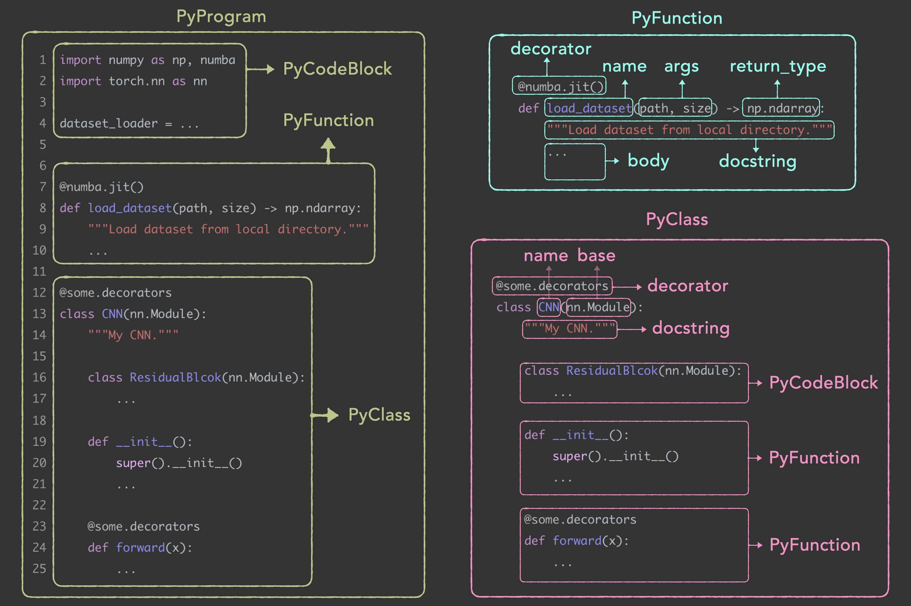

# Py-ADTools：面向 LLM 算法设计的代码解析与安全评估工具箱

[English](./README.md)

<div align="center">
<a href="https://github.com/RayZhhh/py-adtools"></a>
<a href="https://github.com/RayZhhh/py-adtools/blob/main/LICENSE"></a>
<a href="https://deepwiki.com/RayZhhh/py-adtools"></a>
</div>
<br>

下图展示了 `adtools` 如何将一段 Python 源代码解析为结构化的 [PyCodeBlock](./adtools/py_code.py#L18-L33)、[PyFunction](./adtools/py_code.py#L37-L126)、[PyClass](./adtools/py_code.py#L129-L206) 和 [PyProgram](./adtools/py_code.py#L209-L256) 对象。



------

## 安装

> [!TIP]
>
> 推荐使用 Python 3.10 及以上版本。

直接从 GitHub 安装最新版：

```shell
pip install git+https://github.com/RayZhhh/py-adtools.git
```

或通过 pip 安装稳定版：

```shell
pip install py-adtools
```

## 教程

| 教程 | Colab |
| :--- | :--- |
| **01. 代码解析** | [](https://colab.research.google.com/github/RayZhhh/py-adtools/blob/main/tutorial/01_py_code.ipynb) |
| **02. 安全执行** | [](https://colab.research.google.com/github/RayZhhh/py-adtools/blob/main/tutorial/02_sandbox.ipynb) |
| **03. 装饰器** | [](https://colab.research.google.com/github/RayZhhh/py-adtools/blob/main/tutorial/03_decorators.ipynb) |
| **04. 评估器** | [](https://colab.research.google.com/github/RayZhhh/py-adtools/blob/main/tutorial/04_evaluator.ipynb) |

## 代码解析工具：[py_code](./adtools/py_code.py)

[adtools.py_code](./adtools/py_code.py) 能够将 Python 源代码解析为结构化组件，不仅可以分析，支持以编程方式修改代码结构。

### 核心组件

解析器将代码拆解为以下四类核心对象：

| **组件** | **描述** | **关键属性** |
|---|---|---|
| **PyProgram** | 对应整个源文件。严格保留了脚本、函数和类的原始顺序。 | `functions`, `classes`, `scripts`, `elements` |
| **PyFunction** | 对应顶级函数或类方法。支持动态修改函数名、参数、装饰器、文档字符串或函数体。 | `name`, `args`, `body`, `docstring`, `decorator`, `return_type` |
| **PyClass** | 对应类定义。作为方法和类属性的容器。 | `name`, `bases`, `functions` (methods), `body` |
| **PyCodeBlock** | 对应非结构化的代码块，如 `import` 语句、全局变量定义或类中的特定逻辑段。 | `code` |

### 基础用法

```python
from adtools import PyProgram

code = r"""
import ast, numba                 # 解析为 PyCodeBlock
import numpy as np

@numba.jit()                      # 解析为 PyFunction
def function(arg1, arg2=True):     
    '''Docstring.
    This is a function.
    '''
    if arg2:
    	return arg1 * 2
    else:
    	return arg1 * 4

@some.decorators()                # 解析为 PyClass
class PythonClass(BaseClass):
    '''Docstring.'''
    # Comments
    class_var1 = 1                # 解析为 PyCodeBlock
    class_var2 = 2                # 位于 PyClass.body 中

    def __init__(self, x):        # 解析为 PyFunction
        self.x = x                # 位于 PyClass.functions 中

    def method1(self):
        '''Docstring.
        This is a class method.
        '''
        return self.x * 10

    @some.decorators()
    def method2(self, x, y):
    	return x + y + self.method1(x)
    
    @some.decorators(100)  
    class InnerClass:             # 解析为 PyCodeBlock
        '''Docstring.'''
        def __init__(self):       # 位于 PyClass.body 中
            ...

if __name__ == '__main__':        # 解析为 PyCodeBlock
	res = function(1)
	print(res)
	res = PythonClass().method2(1, 2)
"""

# 解析并打印结构
p = PyProgram.from_text(code, debug=True)
print(p)
print(f"-------------------------------------")
print(p.classes[0].functions[1])
print(f"-------------------------------------")
print(p.classes[0].functions[2].decorator)
print(f"-------------------------------------")
print(p.functions[0].name)

```

### 关键特性

- **结构无损**：严格保留原始代码的缩进和格式。
- **智能处理多行字符串**：即使代码中包含复杂的 SQL 或长文本，也能正确识别，不会误伤其中的缩进。
- **便捷操作**：像操作对象属性一样修改函数名、文档或代码体。
- **全量还原**：[PyProgram](./adtools/py_code.py#L209-L256) 能够将修改后的组件完美还原为可执行的 Python 代码。

## 安全沙盒：`sandbox`

`adtools.sandbox` 提供了代码执行的“隔离区”。它将不受信任的代码放入独立进程中运行，支持超时强制结束、资源隔离和静默执行（重定向输出）。

### 基础用法

使用 `SandboxExecutor` 包装任何对象，即可将其方法的执行隔离到新进程中。

```python
import time
from typing import Any
from adtools.sandbox.sandbox_executor import SandboxExecutor


class SortAlgorithmEvaluator:
    def evaluate_program(self, program: str) -> Any | None:
        g = {}
        # 注意：在沙盒进程中执行 exec 相对安全
        exec(program, g)
        sort_algo = g.get("merge_sort")
        if not sort_algo: return None

        input_data = [10, 2, 4, 76, 19, 29, 3, 5, 1]
        start = time.time()
        res = sort_algo(input_data)
        duration = time.time() - start

        return duration if res == sorted(input_data) else None


code_generated_by_llm = """
def merge_sort(arr):
    # ... (省略具体实现) ...
    return sorted(arr)
"""

if __name__ == "__main__":
    # 初始化沙盒执行器
    sandbox = SandboxExecutor(SortAlgorithmEvaluator(), debug_mode=True)

    # 安全执行 evaluate_program 方法
    score = sandbox.secure_execute(
        "evaluate_program",
        method_args=(code_generated_by_llm,),
        timeout_seconds=10  # 超过 10 秒强制杀死进程
    )
    print(f"Score: {score}")
```

### 两种沙盒模式

- **[SandboxExecutor](./adtools/sandbox/sandbox_executor.py)**
    - **原理**：基于 Python 标准库 `multiprocessing`。
    - **通信**：使用共享内存（Shared Memory）回传结果，避免大数据传输时的 Pickle 序列化瓶颈。
    - **场景**：单机环境下的通用代码执行。

- **[SandboxExecutorRay](./adtools/sandbox/sandbox_executor_ray.py)**
    - **原理**：基于 Ray 分布式框架。
    - **优势**：支持集群部署，对象传输零拷贝（Zero-Copy）。
    - **场景**：多机集群、需要 GPU 调度或极高隔离度的场景。

### 装饰器用法 (`@sandbox_run`)

对于简单的函数调用，直接加上装饰器即可实现沙盒化。

```python
from adtools.sandbox import sandbox_run

@sandbox_run(timeout=5.0)
def calculate(x):
    # 这个函数会在一个全新的进程中运行
    return x ** 2

res = calculate(10)
# 返回结构: {'result': 100, 'evaluate_time': 0.0xxx, 'error_msg': ''}
print(f"Result: {res['result']}")
```

## 代码评估框架：`evaluator`

`adtools.evaluator` 是一套用于验证代码正确性和性能的标准化框架。

### 基础用法

继承 `PyEvaluator` 并实现 `evaluate_program` 方法：

```python
import time
from typing import Dict, Callable, List, Any
from adtools.evaluator import PyEvaluator

class SortAlgorithmEvaluator(PyEvaluator):
    def evaluate_program(
            self,
            program_str: str,
            callable_functions_dict: Dict[str, Callable] | None,
            # ... 其他参数会自动传入
            **kwargs,
    ) -> Any | None:
        """
        在此方法中编写你的测试逻辑。
        adtools 已经帮你完成了 exec(program_str) 并提取了所有函数。
        """
        # 直接获取可调用的函数对象
        sort_algo = callable_functions_dict.get("merge_sort")
        
        input = [10, 2, 4, 76, 19, 29, 3, 5, 1]
        start = time.time()
        res = sort_algo(input)
        duration = time.time() - start
        
        if res == sorted(input):
            return duration
        else:
            return None

# LLM 生成的代码
code = "def merge_sort(arr): return sorted(arr)"

# 有害代码（无限循环）
harmful_code = "def merge_sort(arr): while True: pass"

if __name__ == "__main__":
    evaluator = SortAlgorithmEvaluator()

    # 1. 调试模式（当前进程直接执行）
    score = evaluator._exec_and_get_res(code)
    
    # 2. 安全模式（沙盒中执行，带超时）
    score = evaluator.secure_evaluate(code, timeout_seconds=10)
    print(f"Score: {score}")

    # 3. 拦截无限循环
    # 因为超时，这里会迅速返回 None，且主程序不受影响
    score = evaluator.secure_evaluate(harmful_code, timeout_seconds=2)
    print(f"Score: {score}")
```

### 评估器选择

*   **[PyEvaluator](./adtools/evaluator/py_evaluator.py)**：默认选择。使用共享内存优化数据传输，适合大多数场景。
*   **[PyEvaluatorRay](./adtools/evaluator/py_evaluator_ray.py)**：如果你的评估过程涉及超大对象（如大型 Tensor）返回，或者需要在集群上分发任务，请使用此版本。

## 实战场景

### 场景 1：重构代码

解析器不仅能读，还能改。比如批量修改函数名、去除装饰器：

```python
from adtools import PyProgram

code = r'''
@jit(nopython=True)
def heuristics(x):
    """Calculates the heuristic value."""
    return x * 0.5
'''

program = PyProgram.from_text(code)
func = program.functions[0]

# 修改属性
func.name = "fast_heuristics"
func.decorator = None  # 移除装饰器
func.docstring = "Optimized heuristic calculation."

# 重新生成代码
print(program)
# 输出:
# def fast_heuristics(x):
#     """Optimized heuristic calculation."""
#     return x * 0.5
```

### 场景 2：构建 LLM 提示词 (Prompt Engineering)

在自动化算法设计中，你可能需要提取 LLM 生成的函数，标准化它们的格式，再喂给 LLM 进行下一轮进化。

```python
from adtools import PyFunction

# 假设这是 LLM 输出的一段乱糟糟的代码
llm_output = '''
def crossover(p1, p2):
    """Single point crossover."""
    # ... logic ...
    return p1, p2
'''

# 提取函数
func = PyFunction.extract_first_function_from_text(llm_output)

# 规范化：重命名为 v1，并移除文档字符串以节省 Token
func.name = "crossover_v1"
func.docstring = None

# 构建新的 Prompt
prompt = f"Based on the following algorithm:\n{func}\nPlease optimize it."
```

### 场景 3：防御恶意代码

当你的系统自动运行 LLM 生成的代码时，必须防止死循环或恶意操作拖垮服务。`adtools` 的沙盒机制能完美解决这个问题。即使代码里写了 `while True` 或者 `time.sleep(1000)`，`secure_evaluate` 也会在指定超时时间到达时，干净利落地杀死子进程并清理所有资源。

## 许可证

本项目采用 **MIT 许可证**。详情请参阅 [LICENSE](./LICENSE) 文件。

## 联系与反馈

如有问题或建议，欢迎提交 [Issue](https://github.com/RayZhhh/py-adtools/issues)。